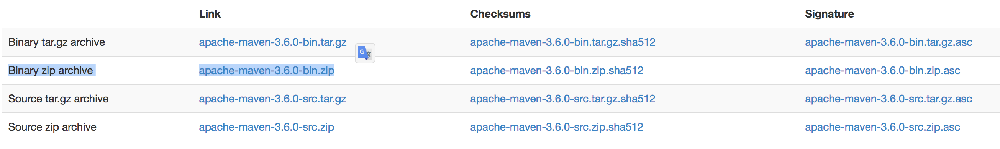

# 安装

https://maven.apache.org/download.cgi
 
下载后解压即可
## 目录结构

解压后的目录结构

``` bash
$ ls
.
├── LICENSE
├── NOTICE
├── README.txt
├── bin
│   ├── m2.conf
│   ├── mvn
│   ├── mvn.cmd
│   ├── mvnDebug
│   ├── mvnDebug.cmd
│   └── mvnyjp
├── boot
│   └── plexus-classworlds-2.5.2.jar
├── conf
│   ├── logging
│   ├── settings.xml
│   └── toolchains.xml
└── lib
    ├── animal-sniffer-annotations-1.14.jar
    ├── animal-sniffer-annotations.license
    ...
```


- `./bin/mvn` 就是mvn程序

- `./conf/settings.xml`就是配置文件

```bash
$ ./bin/mvn -v
Apache Maven 3.6.0 (97c98ec64a1fdfee7767ce5ffb20918da4f719f3; 2018-10-25T02:41:47+08:00)
Maven home: /Users/apple/Downloads/apache-maven-3.6.0
Java version: 10, vendor: Oracle Corporation, runtime: /Library/Java/JavaVirtualMachines/jdk-9.0.1.jdk/Contents/Home
Default locale: en_CN, platform encoding: UTF-8
OS name: "mac os x", version: "10.12.6", arch: "x86_64", family: "mac"
```

## path
将bin目录添加到$path中
``` bash
$ vi ~/.bash_profile

# 添加
# PATH="YOU__PATH_TO_MAVEN:$PATH"

$ source ~/.bash_profile
# 只在当前shell生效，要想全局使用，要重新登录系统用户
```

## ln
如果你的环境变量不生效，可以通过软连接的方式来添加
```bash
$ ln -s /Users/apple/Downloads/apache-maven-3.6.0/bin/mvn /usr/local/bin
```
在已被添加到`path`的目录中创建一个对于刚刚下载的`mvn`的软链接就行。把上面的目录换成你自己的。


### 镜像

在配置文件中添加这个，使用阿里云的镜像。

```xml
<mirrors>
    <mirror>
      <id>alimaven</id>
      <name>aliyun maven</name>
      <url>http://maven.aliyun.com/nexus/content/groups/public/</url>
      <mirrorOf>central</mirrorOf>
    </mirror>
 </mirrors>
```

