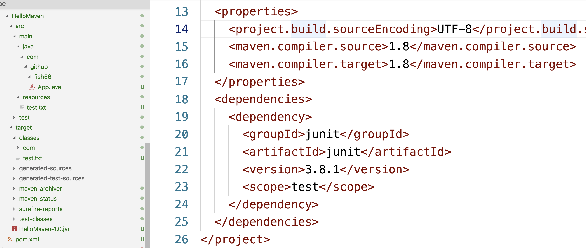

### 初始化项目

首先我们来初始化一个maven项目。

```bash
# 我们的maven都是根据既有的模板来创建的
$ mvn archetype:generate
# 然后它会进入一个交互式界面，要求我们填写一些必要的信息

# 首先它会要求我们选择一个模板
[INFO] No archetype defined. Using maven-archetype-quickstart (org.apache.maven.archetypes:maven-archetype-quickstart:1.0)
Choose archetype:
1: internal -> org.apache.maven.archetypes:maven-archetype-archetype (An archetype which contains a sample archetype.)
2: internal -> org.apache.maven.archetypes:maven-archetype-j2ee-simple (An archetype which contains a simplifed sample J2EE application.)
。。。。。
# 这里，我们直接回车，选择默认的设置
# 也就是 maven-archetype-quickstart
# 然后它就会开始下载这个模板

# 然后它会要求我们设置groupID, artifactId, version, package
Define value for property 'groupId': com.github.fish56
Define value for property 'artifactId': HelloMaven
Define value for property 'version' 1.0-SNAPSHOT: : 1.0
Define value for property 'package' com.github.fish56: : jar
Confirm properties configuration:
groupId: com.github.fish56
artifactId: HelloMaven
version: 1.0
package: jar
 Y: : Y
```


```
.
└── HelloMaven
    ├── pom.xml
    └── src
        ├── main
        │   └── java
        │       └── App.java
        └── test
            └── java
                └── AppTest.java
```

这是生成的pom文件

```xml
<project xmlns="http://maven.apache.org/POM/4.0.0" xmlns:xsi="http://www.w3.org/2001/XMLSchema-instance"
  xsi:schemaLocation="http://maven.apache.org/POM/4.0.0 http://maven.apache.org/xsd/maven-4.0.0.xsd">
  <modelVersion>4.0.0</modelVersion>

  <groupId>com.github.fish56</groupId>
  <artifactId>HelloMaven</artifactId>
  <version>1.0</version>
  <packaging>jar</packaging>

  <name>HelloMaven</name>
  <url>http://maven.apache.org</url>

  <properties>
    <project.build.sourceEncoding>UTF-8</project.build.sourceEncoding>
  </properties>

  <dependencies>
    <dependency>
      <groupId>junit</groupId>
      <artifactId>junit</artifactId>
      <version>3.8.1</version>
      <scope>test</scope>
    </dependency>
  </dependencies>
</project>
```

```java
package com.github.fish56;

/**
 * Hello world!
 *
 */
public class App 
{
    public static void main( String[] args )
    {
        System.out.println( "Hello World!" );
    }
}
```

然后我们创建一个在`src/main`里面创建一个`resources`文件夹，然后随便创建一个静态资源文件。等会打包的

时候就可看到静态资源文件也被打包了。

### 编译

```bash
$ cd HelloMaven
$ mvn compile

[ERROR] Failed to execute goal org.apache.maven.plugins:maven-compiler-plugin:3.1:compile (default-compile) on project HelloMaven: Compilation failure: Compilation failure: 
[ERROR] Source option 5 is no longer supported. Use 6 or later.
[ERROR] Target option 1.5 is no longer supported. Use 1.6 or later.
[ERROR] -> [Help 1]
[ERROR] 
[ERROR] To see the full stack trace of the errors, re-run Maven with the -e switch.
[ERROR] Re-run Maven using the -X switch to enable full debug logging.
[ERROR] 
[ERROR] For more information about the errors and possible solutions, please read the following articles:
[ERROR] [Help 1] http://cwiki.apache.org/confluence/display/MAVEN/MojoFailureException
```


然后其实会爆出一个错误，我们需要额外添加一个东西

```xml
<properties>
        <!-- 没有的话会报出Source option 5 is no longer supported. Use 6 or later.的错误
             https://stackoverflow.com/questions/49028810 -->
        <maven.compiler.source>1.8</maven.compiler.source>
        <maven.compiler.target>1.8</maven.compiler.target>
 </properties>
```

把这个添加到pom文件，然后在编译就成功了

```
.
├── pom.xml
├── src
│   ├── main
│   │   ├── java
│   │   │   └── com
│   │   │       └── github
│   │   │           └── fish56
│   │   │               └── App.java
│   │   └── resources
│   │       └── test.txt
│   └── test
│       └── java
│           └── com
│               └── github
│                   └── fish56
│                       └── AppTest.java
└── target
    ├── classes
    │   ├── com
    │   │   └── github
    │   │       └── fish56
    │   │           └── App.class
    │   └── test.txt
    ├── generated-sources
    │   └── annotations
    └── maven-status
        └── maven-compiler-plugin
            └── compile
                └── default-compile
                    ├── createdFiles.lst
                    └── inputFiles.lst
```

可以看到class文件和静态资源都编译到`./target/classes`目录下了。这样我们开发时把配置文件放到这个目录，编译后就到了classes文件夹，到时候就程序就可通过classpath来搜寻配置文件了。


### 运行

可以通过java命令直接运行，但是到手动的把各种依赖添加到classpath：

``` bash
$ java -cp ~/.m2/repository:./target/classes com.github.fish56.App
Hello World!
```

最好是通过maven命令来运行

```bash
$ mvn exec:java -Dexec.mainClass="com.github.fish56.App"

[INFO] Scanning for projects...
[INFO] 
[INFO] --------------------< com.github.fish56:HelloMaven >--------------------
[INFO] Building HelloMaven 1.0
[INFO] --------------------------------[ jar ]---------------------------------
[INFO] 
[INFO] --- exec-maven-plugin:1.6.0:java (default-cli) @ HelloMaven ---
Hello World!
[INFO] ------------------------------------------------------------------------
[INFO] BUILD SUCCESS
[INFO] ------------------------------------------------------------------------
[INFO] Total time:  3.406 s
[INFO] Finished at: 2019-04-05T16:50:31+08:00
[INFO] ------------------------------------------------------------------------
```


### 测试

``` bash
$ mvn test
```


### 打包

```bash
$ mvn package
```





## 小记

Maven命令是互相叠加的。

- 执行上面几个命令时，如果发现本地没有依赖的jar包，都会使用类似于`maven-resources-plugin:2.6:resources`的命令从中央仓库下载依赖。
- `mvn package`是其实还会执行`mvn compile`