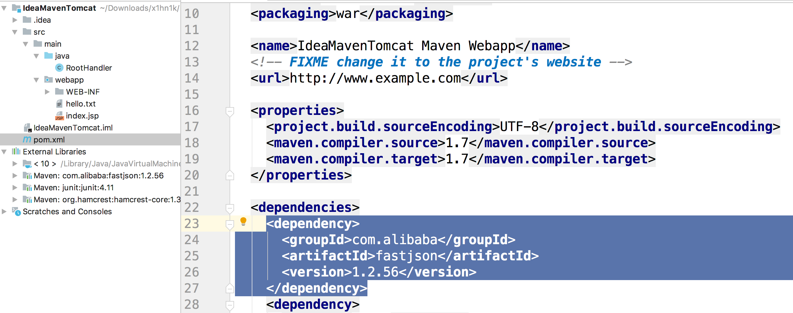
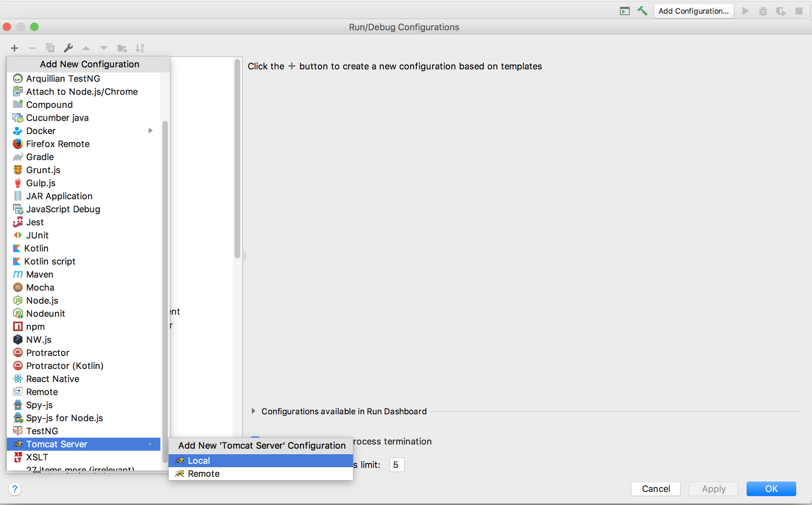
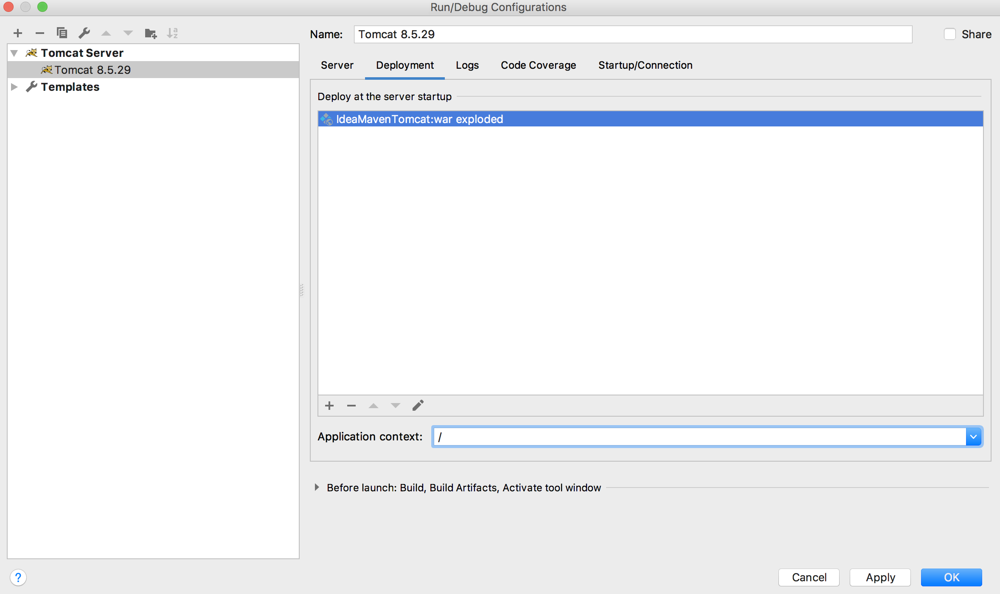

## IDEA + Maven + Tomcat 搭建web开发环境

基于下面的模板来初始化项目。（一些傻瓜式步骤都省略了，用过Idea的都懂）


好我们得到了下面的目录结构，idea很智能的识别出webapp这个文件夹。值得注意的是，**我们打包的方式是`war`**,这个很重要！！


其实我们的web工程无外乎

- 依赖的jar包
- 源代码编译的class文件
- 配置文件
- 静态资源文件
- jsp文件

把上面的资源打包成war文件，交给Tomcat就可以了。


为了演示方便我们，我们在目录中创建下面的文件。



我在pom文件中添加了一个依赖，其实我根本没用它，我只是希望展示下打包流程。

同理，大家执行创建另外两个文件，内容不重要。


## 打包

``` bash
$ mav package 
```


可以看到打包了，然后把它放在服务器上就行了，不过这里我们直接使用IDEA集成tomcat吧。


我们可以看到，和之前不一样的是，这次打包出了IdeaMavenTomcat。

- 源文件都被编译到了`WEB_INF/classes`文件夹
- 第三方`jar`包被编译到了`WEB-INFO/lib`文件夹
- 静态字段，JSP也成功编译

符合我们的web工程目录，同时也帮我生成了`war`包。

### 配置Tomcat


- 先点击右上角的`Add Configuration`，弹出下面的对话框
- 再点击左上角的`+`，选择Tomcat Server



在弹出来的界面配置端口号


然后点击Deployment




然后我们就可以启动了

